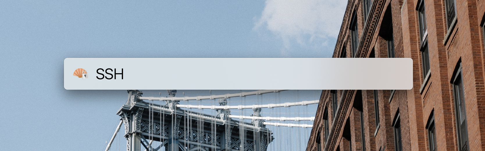

SSH (LaunchBar Action)
----------------------

This **SSH** action allows you quickly connect to previously used ssh connections. Therefor it reads your `.zsh_history` and your `.bash_history` and gives you a list of all available ssh connections. Fuzzy search on that list is available as well.

## Installation

Clone/download this repository's master and double-click *SSH.lnbaction*. LaunchBar will then prompt you, whether you want to install it.

## Usage

Type *ssh* and **SSH** should then appear. Press either the *return*- or the *space*-key and type in a host you recently connected to. Press the *return* key again to open a new terminal window running an ssh connection to that specific host.
